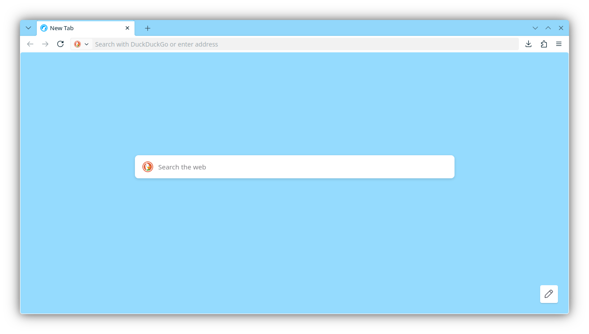

# breezefoxcss
Firefox userChrome.css made to match KDE's Breeze theming

# Screenshots:

# How to:
- Use System theme - auto
- Enable toolkit.legacyUserProfileCustomizations.stylesheets , widget.gtk.rounded-bottom-corners.enabled , svg.context-properties.content.enabled , browser.compactmode.show in about:config
- Set widget.use-xdg-desktop-portal.file-picker to 1 , browser.uidensity to 1 in about:config
- Put all the files into the chrome folder inside your browser profile folder
- Profit

# Thanks to:
- QNetITQ/WaveFox
- RobotoSkunk/zen-better-findbar
- AmirhBeigi/zen-floating-statusbar
