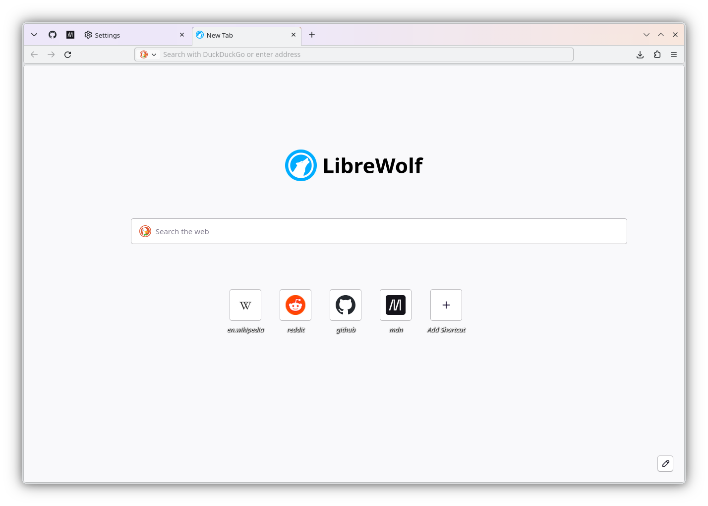
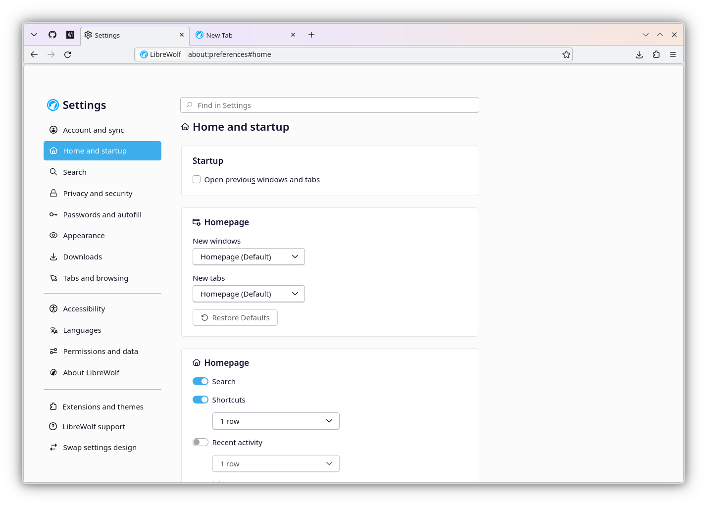

# breezefoxcss
Firefox userChrome.css made to match KDE's Breeze theming
- Supports Nova and pre-redesign UI

# Screenshots:

# How to:
1. Use System theme - auto
2. Enable toolkit.legacyUserProfileCustomizations.stylesheets, browser.compactmode.show in about:config
3. Set widget.use-xdg-desktop-portal.file-picker to 1 , browser.uidensity to 1 in about:config
4. Put all the files into the chrome folder inside your browser profile folder
5. Profit

# Thanks to:
- QNetITQ/WaveFox
- RobotoSkunk/zen-better-findbar
- AmirhBeigi/zen-floating-statusbar
